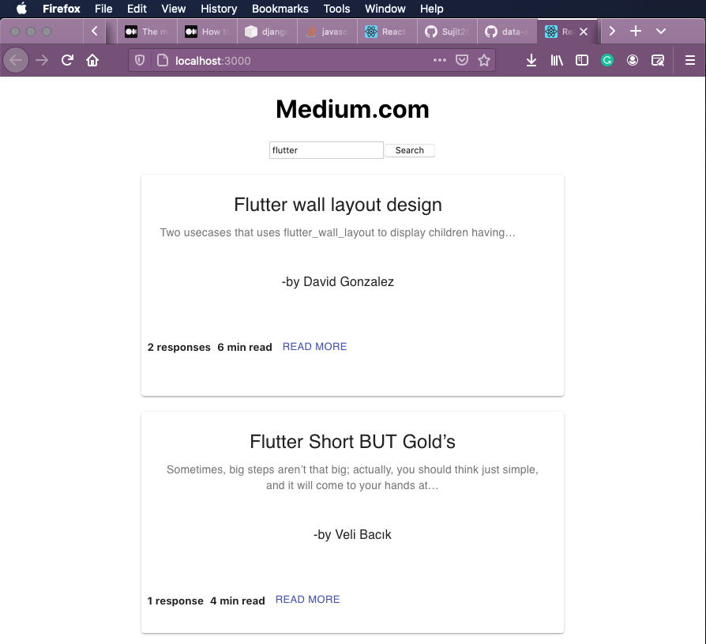

# Data Scraping of medium.com

Command to run:  
Clone the project
Open terminal in cloned directory 
## Activate virtual environment

  python3 -m venv env  
  source env/bin/activate  
  
## Install requinments
  cd backend  
  pip3 install -r requirements.txt  

## For Backend
  cd backend/  
  python3 manage.py runserver  
  
  
## For Frontend
  cd frontend/medium  
  npm start   

  

